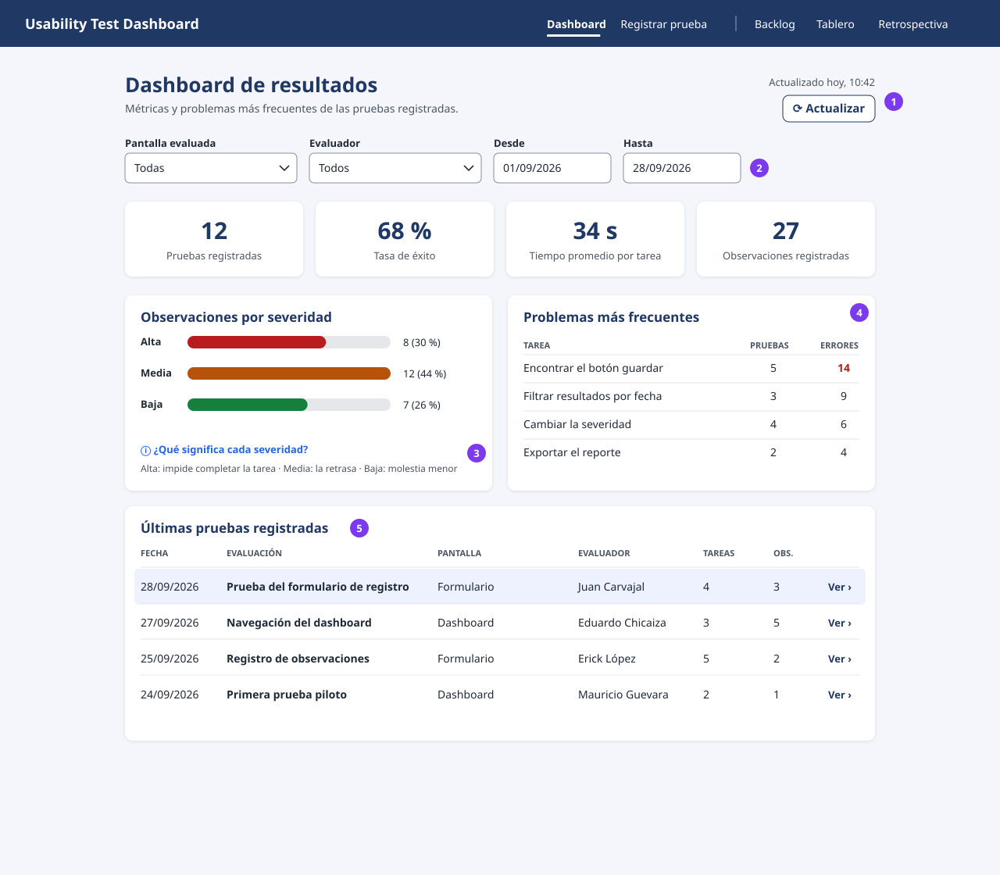
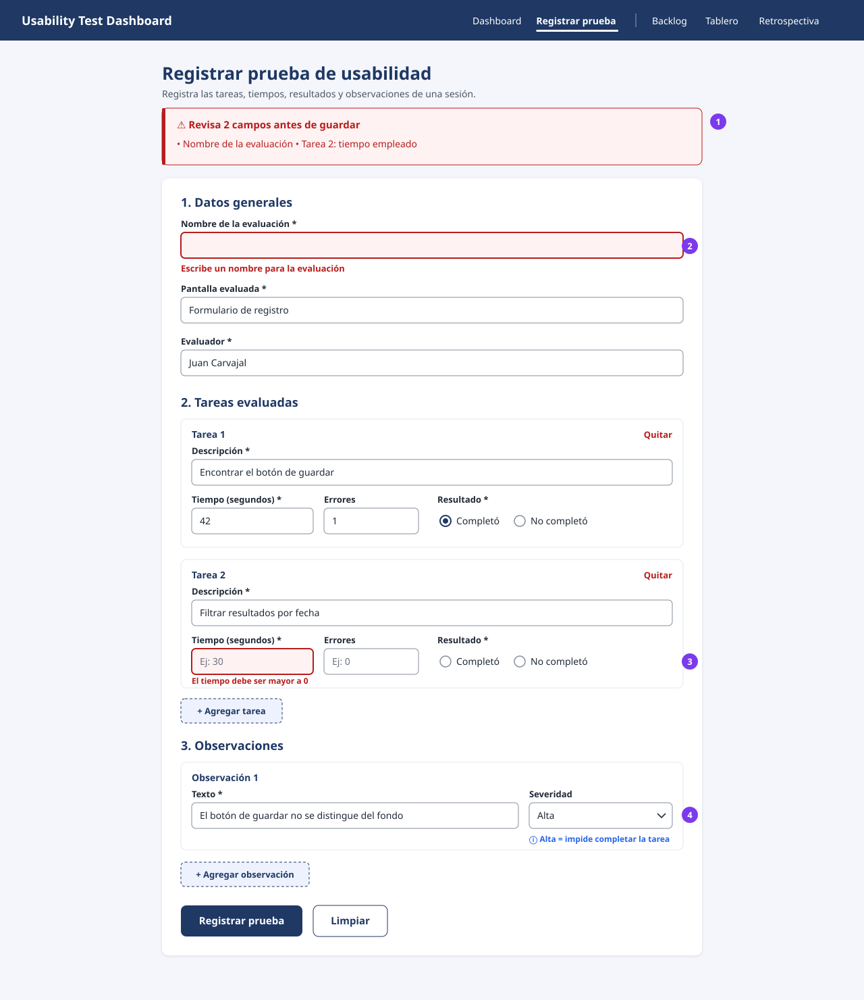
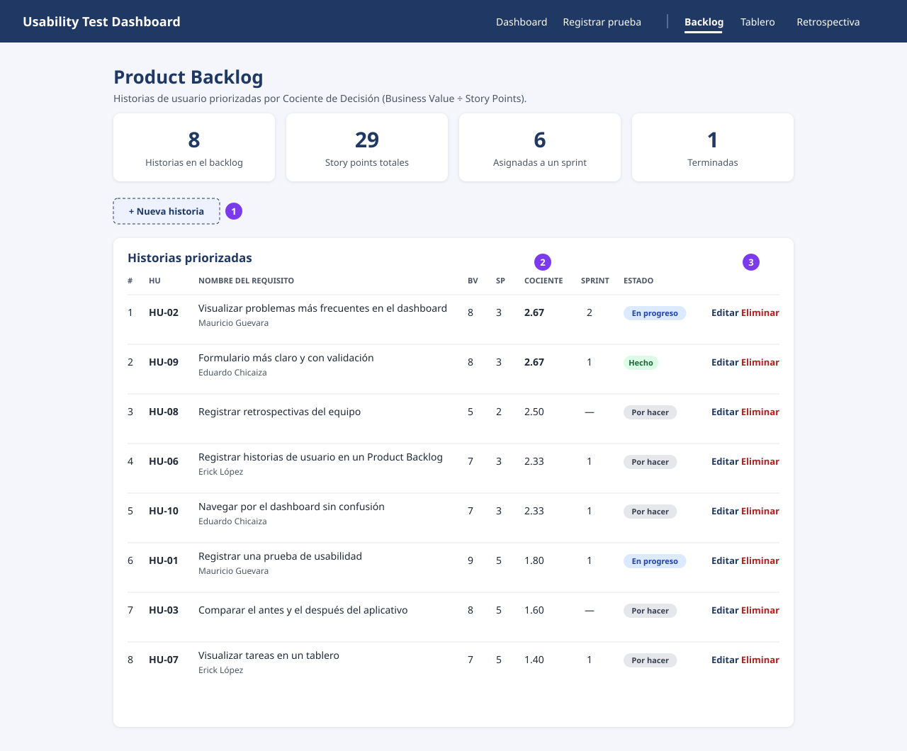
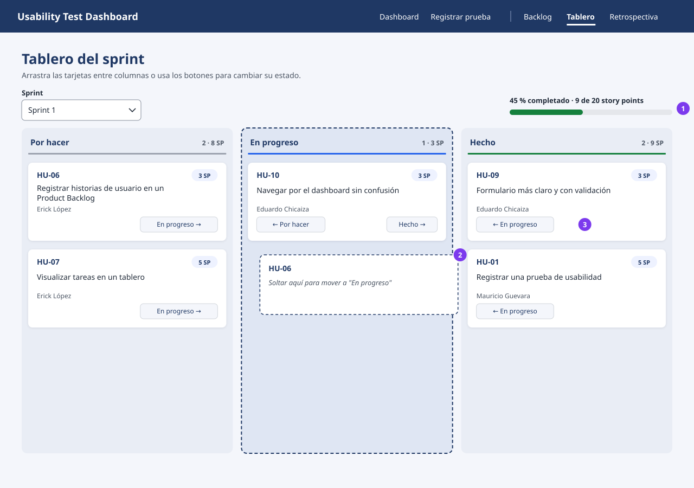
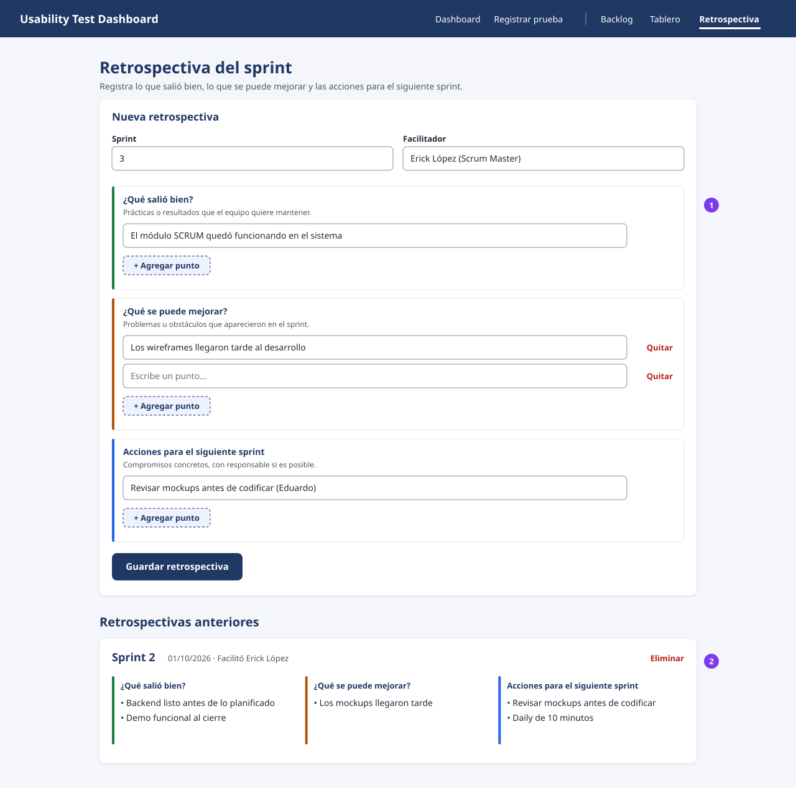

# Wireframes de alta fidelidad

Mockups en SVG con la paleta y tipografía reales del sistema. Se abren en cualquier navegador
y GitHub los muestra directamente. Los círculos morados numerados son anotaciones que se
explican debajo de cada imagen; no son parte de la interfaz.

| Pantalla | Archivo | Estado |
|---|---|---|
| Dashboard de resultados | [`dashboard.svg`](./alta-fidelidad/dashboard.svg) | Propuesta: aplica las correcciones del diagnóstico, **falta implementarla** |
| Formulario de evaluación | [`formulario.svg`](./alta-fidelidad/formulario.svg) | Propuesta: aplica las correcciones del diagnóstico, **falta implementarla** |
| Product Backlog | [`backlog.svg`](./alta-fidelidad/backlog.svg) | Implementada en `/backlog` |
| Tablero del sprint | [`tablero.svg`](./alta-fidelidad/tablero.svg) | Implementada en `/tablero` |
| Retrospectiva | [`retrospectiva.svg`](./alta-fidelidad/retrospectiva.svg) | Implementada en `/retrospectiva` |

## Tokens de diseño

Salen de `frontend/src/styles.css`. Los marcados con ★ **cambian** respecto al código actual
para corregir los problemas de contraste del diagnóstico (H8-1, H8-2). Todos los contrastes se
calcularon con la fórmula de WCAG 2.1.

| Token | Valor | Uso | Contraste |
|---|---|---|---|
| Primario | `#1f3864` | Navbar, títulos, botón principal | 11.6:1 sobre blanco |
| Fondo | `#f4f6fb` | Fondo de página | – |
| Superficie | `#ffffff` | Tarjetas, radio 10 px, sombra suave | – |
| Texto | `#1f2937` | Texto principal | 14.7:1 |
| ★ Texto secundario | `#4b5563` (antes `#6b7280`) | Subtítulos, etiquetas de tabla | 7.0:1 sobre fondo (antes 4.47:1) |
| ★ Error | `#b91c1c` (antes `#ef4444`) | Mensajes y bordes de error | 6.5:1 (antes 3.76:1) |
| ★ Borde de campo | `#868e9c` (antes `#d1d5db`) | Inputs y selects | 3.3:1 (antes 1.47:1) |
| ★ Severidad alta | `#b91c1c` | Barra y cifra destacada | 5.2:1 sobre la pista gris |
| ★ Severidad media | `#b45309` | Barra | 4.1:1 sobre la pista gris |
| ★ Severidad baja / Hecho | `#15803d` | Barra, columna Hecho, progreso | 4.1:1 sobre la pista gris |
| En progreso | `#2563eb` | Columna En progreso, enlaces de ayuda | 5.2:1 |
| Tipografía | Segoe UI / system-ui | Títulos 26 px bold, secciones 17–18 px bold, cuerpo 14 px, etiquetas 13 px semibold | – |

## 1. Dashboard de resultados

1. **Hora de actualización y botón Actualizar**: el usuario sabe si ve datos frescos sin recargar la página (H1-3).
2. **Filtros** por pantalla, evaluador y rango de fechas (H7-1, propuesta HU-14).
3. **Leyenda de severidad** visible junto al gráfico, y porcentaje al lado de cada barra (H10-1).
4. **Problemas más frecuentes** agrupa la misma tarea entre pruebas: cuántas pruebas la incluyeron y el total de errores. El mayor se resalta (H2-1).
5. **Fecha** como primera columna y fila clicable con **Ver ›** para abrir el detalle, editar o eliminar (H6-1, H3-1, propuesta HU-13).

Además: todos los textos con tildes (H2-2) y sin códigos HU en el subtítulo (H2-3).

## 2. Formulario de evaluación

1. **Resumen de errores** arriba del formulario. Al fallar la validación, la página sube hasta aquí y el foco entra al resumen; cada punto enlaza a su campo (H1-1).
2. **Campo con error**: borde de 2 px y mensaje en `#b91c1c` debajo, con contraste AA (H8-1).
3. **Resultado como radio buttons sin valor por defecto**: el evaluador tiene que decidir si la tarea se completó, no puede olvidarse de desmarcar una casilla (H5-1). Los números empiezan vacíos con un ejemplo en el placeholder, no en 0 (H5-2).
4. **Ayuda de severidad** en línea junto al select (H10-1).

Además: secciones numeradas, tareas y observaciones con título (*Tarea 1*, *Tarea 2*) (H6-2), y botón **Limpiar** (H3-2).

## 3. Product Backlog

1. **+ Nueva historia** abre el formulario encima de la tabla; el código se sugiere solo (siguiente HU libre).
2. **Cociente de Decisión** calculado por el sistema; la tabla siempre está ordenada por él, igual que en la hoja Backlog del Excel.
3. **Editar / Eliminar** por fila. Eliminar pide confirmación.

## 4. Tablero del sprint

1. **Filtro de sprint y avance** en story points terminados.
2. **Arrastrar y soltar**: la columna destino se marca con borde punteado mientras se arrastra.
3. **Botones de mover** en cada tarjeta, para quien usa teclado o no puede arrastrar. Solo aparecen las direcciones posibles.

## 5. Retrospectiva

1. **Tres secciones con color propio** (verde, ámbar, azul) y una ayuda corta de qué escribir en cada una. Se pueden agregar y quitar puntos; los vacíos se ignoran al guardar.
2. **Historial** de retrospectivas, la más reciente primero, con las tres columnas lado a lado para comparar sprints.

## Regenerar los SVG

Los SVG se generaron con un script a partir de estos tokens. Si Eduardo los pasa a Figma o
Penpot, estos archivos quedan como referencia y se pueden reemplazar por las exportaciones.
