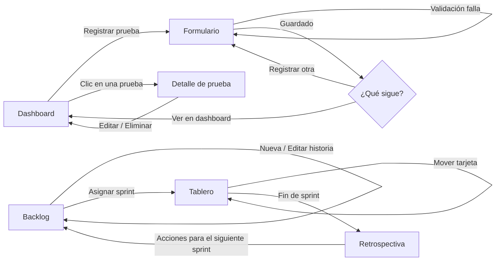

# Wireframes de baja fidelidad

Bocetos de estructura: qué va en cada pantalla y en qué orden, sin colores ni tipografía.
Sirven para discutir el contenido antes de pasar a [alta fidelidad](./alta-fidelidad.md).

Convenciones: `[ Botón ]`, `[____]` campo de texto, `[ v ]` lista desplegable, `[x]` casilla,
`▓▓▓░░` barra de progreso, `( )` insignia o etiqueta.

## User flow



Dos flujos independientes que comparten la barra de navegación:
**evaluación** (Dashboard ↔ Formulario) y **SCRUM** (Backlog → Tablero → Retrospectiva → Backlog).

## 1. Dashboard de resultados (HU-02, HU-10)

```
+--------------------------------------------------------------------------+
| LOGO Usability Test Dashboard     Dashboard  Registrar | Backlog Tablero Retro |
+--------------------------------------------------------------------------+
|  Dashboard de resultados                         Actualizado 10:42 [ ⟳ ] |
|  Métricas de todas las pruebas registradas                                |
|                                                                          |
|  Filtros: Pantalla [ v ]  Evaluador [ v ]  Desde [____] Hasta [____]     |
|                                                                          |
|  +-----------+ +-----------+ +-----------+ +-----------+                 |
|  |    12     | |   68 %    | |   34 s    | |    27     |                 |
|  | Pruebas   | | Éxito     | | Tiempo    | | Observac. |                 |
|  +-----------+ +-----------+ +-----------+ +-----------+                 |
|                                                                          |
|  +-- Observaciones por severidad ----+ +-- Problemas más frecuentes ---+ |
|  | Alta   ▓▓▓▓▓▓░░░░░░░  8   (30 %)  | | Tarea            Pruebas Err. | |
|  | Media  ▓▓▓▓▓▓▓▓▓░░░░ 12   (44 %)  | | Encontrar guardar   5     14  | |
|  | Baja   ▓▓▓▓░░░░░░░░░  7   (26 %)  | | Filtrar por fecha   3      9  | |
|  | (i) Qué significa cada severidad  | | ...                           | |
|  +-----------------------------------+ +-------------------------------+ |
|                                                                          |
|  +-- Últimas pruebas ------------------------------------------------+   |
|  | Fecha     Evaluación        Pantalla    Evaluador  Tareas  Obs.   |   |
|  | 28/09     Prueba registro   Formulario  Juan C.      4      3   > |   |
|  | 27/09     ...                                                   > |   |
|  +-------------------------------------------------------------------+   |
+--------------------------------------------------------------------------+
```

Notas:
- Las tarjetas de métricas van primero porque responden la pregunta principal: *¿cómo va?*
- "Problemas más frecuentes" agrupa por tarea y excluye las que tienen 0 errores (hallazgo H2-1).
- La fecha es la primera columna de la tabla (H6-1) y cada fila abre el detalle (H3-1).

## 2. Formulario de evaluación (HU-01, HU-09)

```
+--------------------------------------------------------------------------+
| NAVBAR                                                                   |
+--------------------------------------------------------------------------+
|  Registrar prueba de usabilidad                                          |
|                                                                          |
|  +-- ! Revisa 2 campos antes de guardar ----------------------------+    |
|  |  · Nombre de la evaluación   · Tarea 2: tiempo                    |    |
|  +------------------------------------------------------------------+    |
|                                                                          |
|  1. Datos generales                                                      |
|     Nombre de la evaluación*  [__________________________]               |
|     Pantalla evaluada*        [__________________________]               |
|     Evaluador*                [__________________________]               |
|                                                                          |
|  2. Tareas evaluadas                                                     |
|     +-- Tarea 1 -------------------------------------------[ Quitar ]+   |
|     | Descripción* [______________________________]                  |   |
|     | Tiempo (s)* [____]   Errores [____]                            |   |
|     | Resultado:  ( ) Completó   ( ) No completó    <- sin marcar     |   |
|     +----------------------------------------------------------------+   |
|     [ + Agregar tarea ]                                                  |
|                                                                          |
|  3. Observaciones                                                        |
|     +-- Observación 1 --------------------------------------[ Quitar ]+  |
|     | Texto* [______________________________]                         |  |
|     | Severidad [ Media v ]  (i) Alta = impide completar la tarea     |  |
|     +-----------------------------------------------------------------+  |
|     [ + Agregar observación ]                                            |
|                                                                          |
|  [ Registrar prueba ]   [ Limpiar ]                                      |
+--------------------------------------------------------------------------+
```

Notas:
- El resumen de errores aparece arriba y el foco salta a él (H1-1).
- El resultado de la tarea es una elección obligatoria, no una casilla marcada por defecto (H5-1).
- Los campos numéricos empiezan vacíos, no en 0 (H5-2).
- Las secciones van numeradas para que el formulario largo se lea por pasos.

## 3. Product Backlog (HU-06)

```
+--------------------------------------------------------------------------+
| NAVBAR                                                                   |
+--------------------------------------------------------------------------+
|  Product Backlog                                                         |
|  Priorizado por Cociente de Decisión (BV ÷ SP)                           |
|                                                                          |
|  +---------+ +---------+ +---------+ +---------+                         |
|  | 8 HU    | | 29 SP   | | 6 en    | | 1       |                         |
|  |         | | totales | | sprint  | | hechas  |                         |
|  +---------+ +---------+ +---------+ +---------+                         |
|                                                                          |
|  [ + Nueva historia ]                                                    |
|                                                                          |
|  +-- (formulario, se abre al crear o editar) ------------------------+   |
|  | Código [HU-11]   Responsable [__________]                          |  |
|  | Nombre del requisito [___________________________________]         |  |
|  | Descripción [ Como… quiero… para… ______________________ ]         |  |
|  | Business Value [__]  Story Points [ 3 v ]                          |  |
|  | Sprint [__]          Estado [ Por hacer v ]                        |  |
|  | [ Guardar ]  [ Cancelar ]                                          |  |
|  +--------------------------------------------------------------------+  |
|                                                                          |
|  # | HU    | Nombre del requisito     | BV | SP | Coc. | Spr | Estado   |
|  1 | HU-02 | Visualizar problemas...  |  8 |  3 | 2.67 |  2  | (En prog)| Editar Eliminar
|  2 | HU-09 | Formulario más claro...  |  8 |  3 | 2.67 |  1  | (Hecho)  | Editar Eliminar
|  ...                                                                     |
+--------------------------------------------------------------------------+
```

## 4. Tablero del sprint (HU-07)

```
+--------------------------------------------------------------------------+
| NAVBAR                                                                   |
+--------------------------------------------------------------------------+
|  Tablero del sprint                                                      |
|  Sprint [ Sprint 1 v ]                      45 % · 9 de 20 SP ▓▓▓▓░░░░░  |
|                                                                          |
|  +-- Por hacer   2·8 SP -+ +-- En progreso 1·3 SP -+ +-- Hecho  2·9 SP --+ |
|  | +------------------+  | | +------------------+  | | +---------------+ | |
|  | | HU-06      (3SP) |  | | | HU-02     (3SP)  |  | | | HU-09  (3SP)  | | |
|  | | Registrar hist...|  | | | Visualizar pro...|  | | | Formulario... | | |
|  | | Erick L.         |  | | | Mauricio G.      |  | | | Eduardo C.    | | |
|  | |    [En progreso→]|  | | |[←Por hacer][Hecho→] | | |[←En progreso] | | |
|  | +------------------+  | | +------------------+  | | +---------------+ | |
|  | +------------------+  | |                       | |                   | |
|  | | HU-07 ...        |  | |                       | |                   | |
|  +-----------------------+ +-----------------------+ +-------------------+ |
+--------------------------------------------------------------------------+
```

Notas:
- Las tarjetas se arrastran entre columnas; los botones `←` `→` hacen lo mismo desde el teclado.
- El encabezado de cada columna dice cuántas historias y cuántos story points tiene.

## 5. Retrospectiva (HU-08)

```
+--------------------------------------------------------------------------+
| NAVBAR                                                                   |
+--------------------------------------------------------------------------+
|  Retrospectiva del sprint                                                |
|                                                                          |
|  +-- Nueva retrospectiva -------------------------------------------+    |
|  | Sprint [ 3 ]           Facilitador [____________________]         |    |
|  | | ¿Qué salió bien?                                               |    |
|  | |   [______________________________]  [ Quitar ]                 |    |
|  | |   [ + Agregar punto ]                                          |    |
|  | | ¿Qué se puede mejorar?                                         |    |
|  | |   [______________________________]                             |    |
|  | | Acciones para el siguiente sprint                              |    |
|  | |   [______________________________]                             |    |
|  | [ Guardar retrospectiva ]                                        |    |
|  +------------------------------------------------------------------+    |
|                                                                          |
|  Retrospectivas anteriores                                               |
|  +-- Sprint 2 · 01/10 · Facilitó Erick López ---------------[Eliminar]+  |
|  | Salió bien        | Mejorar            | Acciones                  |  |
|  | · Backend a tiempo| · Mockups tarde    | · Revisar mockups antes   |  |
|  +--------------------------------------------------------------------+  |
+--------------------------------------------------------------------------+
```
